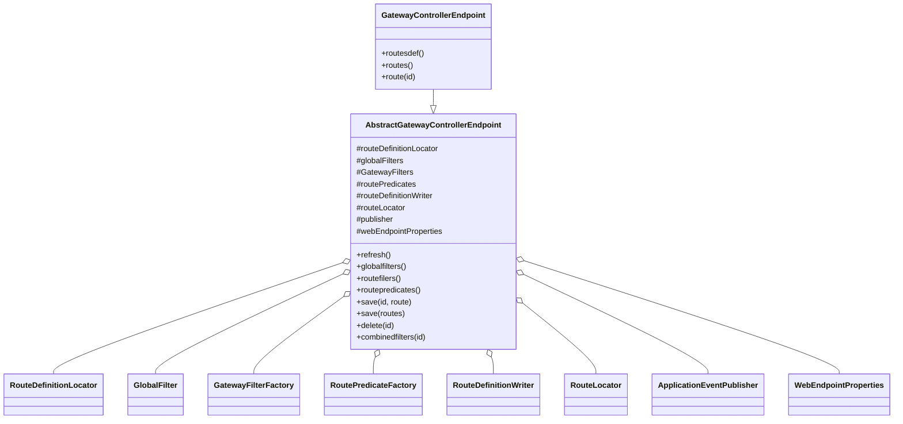

# Spring Cloud Gateway 各功能流程图

---

## 1. 路由匹配与请求转发流程（route/ + handler/）

## 1.1 路由匹配与请求转发详细类图

## 1.2 路由匹配与请求转发典型时序图

## 1.3 代码级解读

- **HandlerMapping** 负责根据请求信息调用 `RouteLocator` 匹配合适的 `Route`。
- **FilteringWebHandler** 是核心处理器，负责：
  - 获取匹配到的 `Route`，合并全局过滤器和路由过滤器，构建有序过滤器链。
  - 调用 `GatewayFilterChain` 依次执行过滤器。
- **GatewayFilterChain** 递归调用每个过滤器的 `filter(exchange, chain)` 方法，形成责任链。
- **Route** 封装了路由的 id、目标 URI、断言（predicate）、过滤器（filters）等。
- **GatewayFilter/GlobalFilter** 实现具体的请求/响应处理逻辑，如鉴权、限流、转发等。
- 过滤器链最后阶段会将请求转发到目标服务（如下游微服务），并将响应依次经过过滤器链返回给客户端。

---

## 2. 过滤器链处理流程（filter/）

## 2.1 过滤器链处理详细类图

## 2.2 过滤器链处理典型时序图

## 2.3 代码级解读

- **GatewayFilterChain** 负责维护过滤器列表，并递归调用每个过滤器的 `filter(exchange, chain)` 方法，形成责任链。
- **GatewayFilter** 是过滤器接口，定义了请求/响应的处理逻辑。
- **GlobalFilter** 是全局过滤器，适配为 GatewayFilter 参与链式处理。
- **OrderedGatewayFilter** 为过滤器增加排序能力，确保执行顺序。
- **GatewayFilterFactory** 用于根据配置动态创建过滤器实例。
- 过滤器链的执行分为两部分：
  1. 请求阶段：依次调用每个过滤器的 `filter(exchange, chain)`，可实现前置处理（如鉴权、限流、日志等）。
  2. 响应阶段：目标服务响应后，过滤器链以相反顺序回溯，执行后置处理（如响应头修改、日志、异常处理等）。
- 典型实现如 `NettyRoutingFilter`、`RequestRateLimiterGatewayFilterFactory` 等，均实现了 GatewayFilter 接口。

---

## 3. 动态路由与服务发现流程（discovery/）

## 3.1 动态路由与服务发现详细类图

## 3.2 动态路由与服务发现典型时序图

## 3.3 代码级解读

- **DiscoveryClientRouteDefinitionLocator** 实现了 `RouteDefinitionLocator`，负责从注册中心（如 Eureka、Nacos）动态获取服务实例，并为每个服务构建路由定义。
- **DiscoveryLocatorProperties** 提供动态路由的配置项，如是否启用、路由前缀、谓词、过滤器等。
- **ReactiveDiscoveryClient** 是 Spring Cloud 的服务发现客户端，负责与注册中心交互，获取服务列表和实例信息。
- 路由定义通过 SpEL 表达式动态生成（如 `urlExpression`、`includeExpression`），支持灵活的路由策略。
- 路由定义被 RouteLocator 聚合，供 FilteringWebHandler 路由匹配与请求转发使用。
- 当服务注册、下线或实例变化时，ReactiveDiscoveryClient 会触发路由表的自动刷新，实现网关的动态服务发现与路由。

---

## 4. Actuator 管理端点流程（actuate/）

## 4.1 Actuator 管理端点详细类图

## 4.2 Actuator 管理端点典型时序图

## 4.3 代码级解读

- **GatewayControllerEndpoint** 继承自 **AbstractGatewayControllerEndpoint**，主要负责对外暴露 REST 管理端点。
- **AbstractGatewayControllerEndpoint** 封装了路由、过滤器、谓词等的查询、增删改、刷新等核心逻辑。
- 主要依赖组件：
  - `RouteLocator`：获取当前所有生效路由
  - `RouteDefinitionLocator`：获取所有路由定义
  - `RouteDefinitionWriter`：持久化路由定义（增删改）
  - `ApplicationEventPublisher`：发布路由刷新、删除等事件
- 典型端点说明：
  - `GET /actuator/gateway/routes`：查询所有路由信息
  - `POST /actuator/gateway/refresh`：刷新路由，发布 `RefreshRoutesEvent`
  - `POST /actuator/gateway/routes/{id}`：新增/更新路由
  - `DELETE /actuator/gateway/routes/{id}`：删除路由，发布 `RouteDeletedEvent`
- 端点方法内部通常会调用对应的依赖组件，完成数据的获取、变更和事件通知。

---

## 5. 配置加载与自动刷新流程（config/ + event/）

## 5.1 配置加载与自动刷新详细类图

## 5.2 配置加载与自动刷新典型时序图

## 5.3 代码级解读

- **GatewayAutoConfiguration** 负责自动装配网关相关的核心 Bean，包括路由定义加载、路由表构建、事件监听等。
- **RouteDefinitionLocator** 负责从配置文件、配置中心等加载路由定义。
- **RouteLocator** 负责根据路由定义构建实际的路由表。
- **RouteRefreshListener** 监听 Spring Cloud 相关的事件（如配置刷新、服务注册、心跳等），在需要时发布 `RefreshRoutesEvent`。
- **FilteringWebHandler** 监听 `RefreshRoutesEvent`，收到事件后会清理缓存并重新获取最新路由，实现路由的动态刷新。
- 整体流程：
  1. 配置变更或服务注册等事件发生。
  2. 事件发布到 Spring 容器，`RouteRefreshListener` 监听到后发布 `RefreshRoutesEvent`。
  3. 相关组件（如 `FilteringWebHandler`）监听到刷新事件，重新加载路由，实现网关的动态配置。

---

## 6. 支持与工具类的作用（support/）

- 该包主要为主流程提供工具方法、常量、辅助数据结构等，不单独形成业务流程，但在各主流程中被频繁调用。

---

如需某一流程的详细类图、时序图或代码级解读，请告知具体功能点！ 