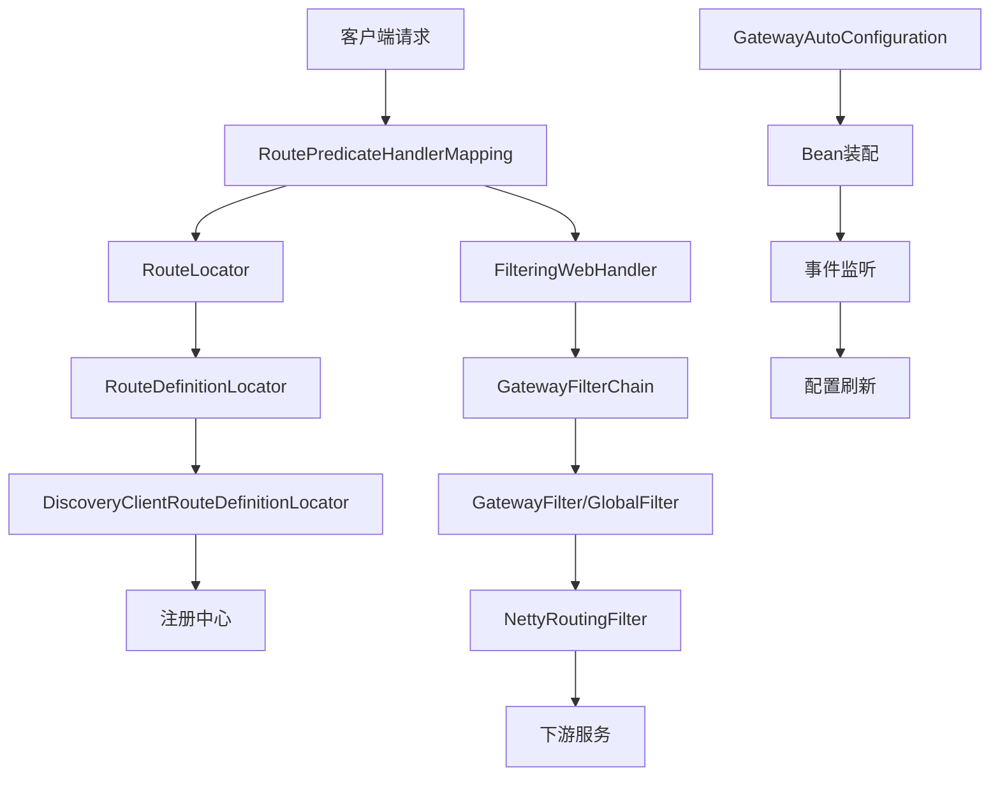

# Spring Cloud Gateway 整体架构分析

## 一、架构层次结构

### 1. 核心架构层次
```
┌─────────────────────────────────────────────────────────────┐
│                    客户端层 (Client Layer)                    │
├─────────────────────────────────────────────────────────────┤
│                   网关入口层 (Gateway Entry)                  │
│  ┌─────────────────┐  ┌─────────────────┐  ┌──────────────┐ │
│  │   WebFlux       │  │     MVC         │  │   WebSocket  │ │
│  │   (响应式)      │  │   (Servlet)     │  │   (实时)     │ │
│  └─────────────────┘  └─────────────────┘  └──────────────┘ │
├─────────────────────────────────────────────────────────────┤
│                   路由匹配层 (Route Matching)                 │
│  ┌─────────────────┐  ┌─────────────────┐  ┌──────────────┐ │
│  │ RoutePredicate  │  │ RouteLocator    │  │ Route        │ │
│  │ (路由断言)      │  │ (路由定位器)     │  │ (路由定义)   │ │
│  └─────────────────┘  └─────────────────┘  └──────────────┘ │
├─────────────────────────────────────────────────────────────┤
│                   过滤器链层 (Filter Chain)                   │
│  ┌─────────────────┐  ┌─────────────────┐  ┌──────────────┐ │
│  │ GlobalFilter    │  │ GatewayFilter   │  │ FilterChain  │ │
│  │ (全局过滤器)    │  │ (网关过滤器)     │  │ (过滤器链)   │ │
│  └─────────────────┘  └─────────────────┘  └──────────────┘ │
├─────────────────────────────────────────────────────────────┤
│                   转发处理层 (Forwarding)                     │
│  ┌─────────────────┐  ┌─────────────────┐  ┌──────────────┐ │
│  │ HTTP/HTTPS      │  │ WebSocket       │  │ LoadBalancer │ │
│  │ (HTTP转发)      │  │ (WebSocket转发) │  │ (负载均衡)   │ │
│  └─────────────────┘  └─────────────────┘  └──────────────┘ │
├─────────────────────────────────────────────────────────────┤
│                   服务发现层 (Service Discovery)              │
│  ┌─────────────────┐  ┌─────────────────┐  ┌──────────────┐ │
│  │ Eureka          │  │ Nacos           │  │ Consul       │ │
│  │ (服务注册中心)  │  │ (配置中心)      │  │ (服务发现)   │ │
│  └─────────────────┘  └─────────────────┘  └──────────────┘ │
└─────────────────────────────────────────────────────────────┘
```

## 二、核心模块架构

### 1. 模块依赖关系
```
spring-cloud-gateway/
├── spring-cloud-gateway-server/          # 核心服务端实现
│   ├── actuate/                          # 监控管理端点
│   ├── config/                           # 自动配置
│   ├── discovery/                        # 服务发现集成
│   ├── event/                            # 事件机制
│   ├── filter/                           # 过滤器实现
│   ├── handler/                          # 请求处理器
│   ├── route/                            # 路由管理
│   └── support/                          # 工具支持
├── spring-cloud-gateway-server-mvc/      # MVC版本实现
├── spring-cloud-gateway-webflux/         # WebFlux扩展
├── spring-cloud-starter-gateway/         # WebFlux Starter
├── spring-cloud-starter-gateway-mvc/     # MVC Starter
└── spring-cloud-gateway-dependencies/    # 依赖管理
```

### 2. 核心组件交互


## 三、设计模式应用

### 1. 核心设计模式
| 设计模式 | 应用场景 | 实现类 |
|---------|---------|--------|
| **责任链模式** | 过滤器链处理 | `GatewayFilterChain`、`FilteringWebHandler` |
| **策略模式** | 路由匹配、过滤器选择 | `RoutePredicateFactory`、`GatewayFilterFactory` |
| **工厂方法模式** | 过滤器创建 | `GatewayFilterFactory`、`RoutePredicateFactory` |
| **装饰器模式** | 过滤器增强 | `OrderedGatewayFilter`、`GatewayFilterAdapter` |
| **观察者模式** | 事件通知 | `RefreshRoutesEvent`、`ApplicationEventPublisher` |
| **适配器模式** | 接口适配 | `GatewayFilterAdapter` |
| **组合模式** | 路由聚合 | `Route`、`CompositeRouteLocator` |

### 2. 架构原则体现
- **单一职责原则**: 每个过滤器只负责特定功能
- **开闭原则**: 通过工厂模式支持扩展新过滤器
- **依赖倒置原则**: 依赖抽象接口而非具体实现
- **接口隔离原则**: 细粒度的过滤器接口设计

## 四、技术栈架构

### 1. 核心技术栈
```
Spring Boot 2.x/3.x
├── Spring WebFlux (响应式编程)
├── Spring Cloud (微服务生态)
├── Netty (异步网络框架)
├── Reactor (响应式流)
└── Spring Security (安全框架)
```

### 2. 扩展技术栈
```
服务发现: Eureka, Nacos, Consul
配置中心: Nacos, Apollo, Spring Cloud Config
监控: Spring Boot Actuator, Micrometer
负载均衡: Spring Cloud LoadBalancer
熔断: Resilience4j, Hystrix
```

## 五、数据流架构

### 1. 请求处理流程
```
客户端请求 → 路由匹配 → 过滤器链 → 请求转发 → 响应处理 → 客户端响应
     ↓           ↓         ↓         ↓         ↓         ↓
   HTTP/HTTPS  Route    Global    Netty     Response   HTTP/HTTPS
   WebSocket   Match    Filter    Client    Filter     WebSocket
```

### 2. 配置管理流程
```
配置文件 → 配置加载 → Bean装配 → 事件发布 → 动态刷新 → 路由更新
    ↓         ↓         ↓         ↓         ↓         ↓
  YAML/     Gateway   Route     Refresh   Route     Filter
  Properties AutoConfig Locator  Event    Refresh   Update
```

## 六、部署架构

### 1. 单机部署
```
┌─────────────────────────────────────────────────────────────┐
│                    Spring Cloud Gateway                     │
│  ┌─────────────┐  ┌─────────────┐  ┌─────────────────────┐ │
│  │  路由配置   │  │  过滤器链   │  │    服务发现         │ │
│  └─────────────┘  └─────────────┘  └─────────────────────┘ │
└─────────────────────────────────────────────────────────────┘
```

### 2. 集群部署
```
┌─────────────────┐  ┌─────────────────┐  ┌─────────────────┐
│   Gateway 1     │  │   Gateway 2     │  │   Gateway N     │
│  ┌───────────┐  │  │  ┌───────────┐  │  │  ┌───────────┐  │
│  │ 负载均衡  │  │  │  │ 负载均衡  │  │  │  │ 负载均衡  │  │
│  └───────────┘  │  │  └───────────┘  │  │  └───────────┘  │
└─────────────────┘  └─────────────────┘  └─────────────────┘
         │                    │                    │
         └────────────────────┼────────────────────┘
                              │
                    ┌─────────────────┐
                    │   注册中心      │
                    │  (Eureka/Nacos) │
                    └─────────────────┘
```

## 七、架构优势

### 1. 技术优势
- **响应式编程**: 基于 WebFlux 的高性能异步处理
- **动态路由**: 支持运行时路由配置更新
- **服务发现**: 自动集成主流注册中心
- **过滤器链**: 灵活的可插拔过滤器机制

### 2. 架构优势
- **高内聚低耦合**: 模块化设计，职责清晰
- **可扩展性强**: 支持自定义过滤器和谓词
- **配置灵活**: 支持多种配置方式和动态刷新
- **监控完善**: 内置 Actuator 监控端点

### 3. 运维优势
- **热更新**: 支持路由配置热更新
- **健康检查**: 内置健康检查机制
- **指标监控**: 丰富的监控指标
- **日志追踪**: 完整的请求追踪链路

---

这个架构设计体现了现代微服务网关的核心要求：高性能、高可用、可扩展、易维护。通过分层架构和设计模式的合理运用，实现了功能强大且易于扩展的网关系统。 