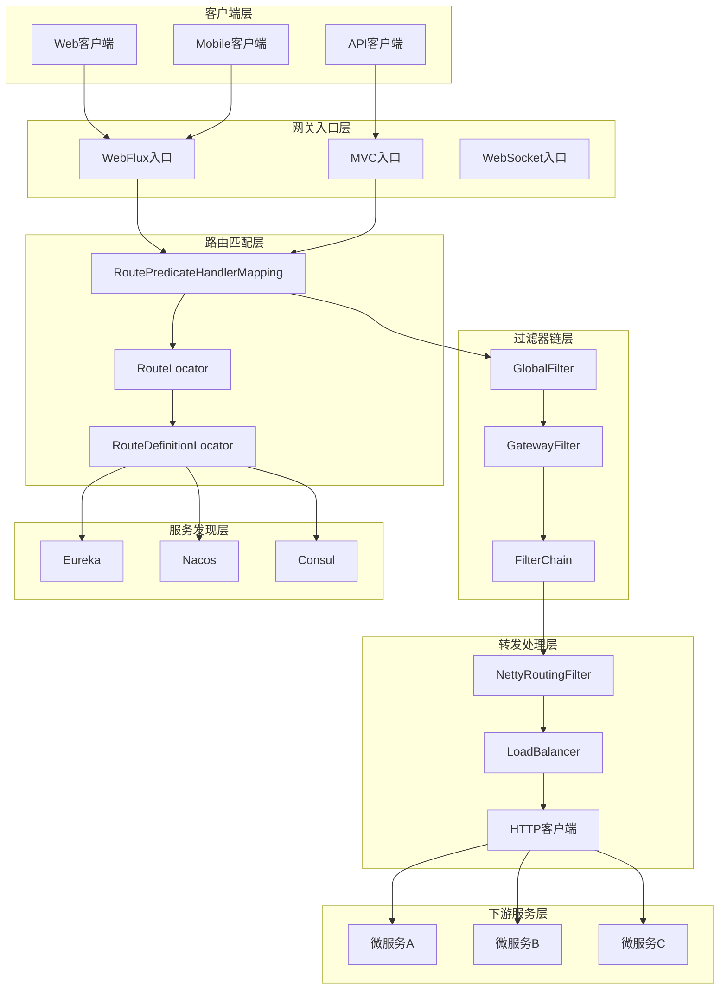
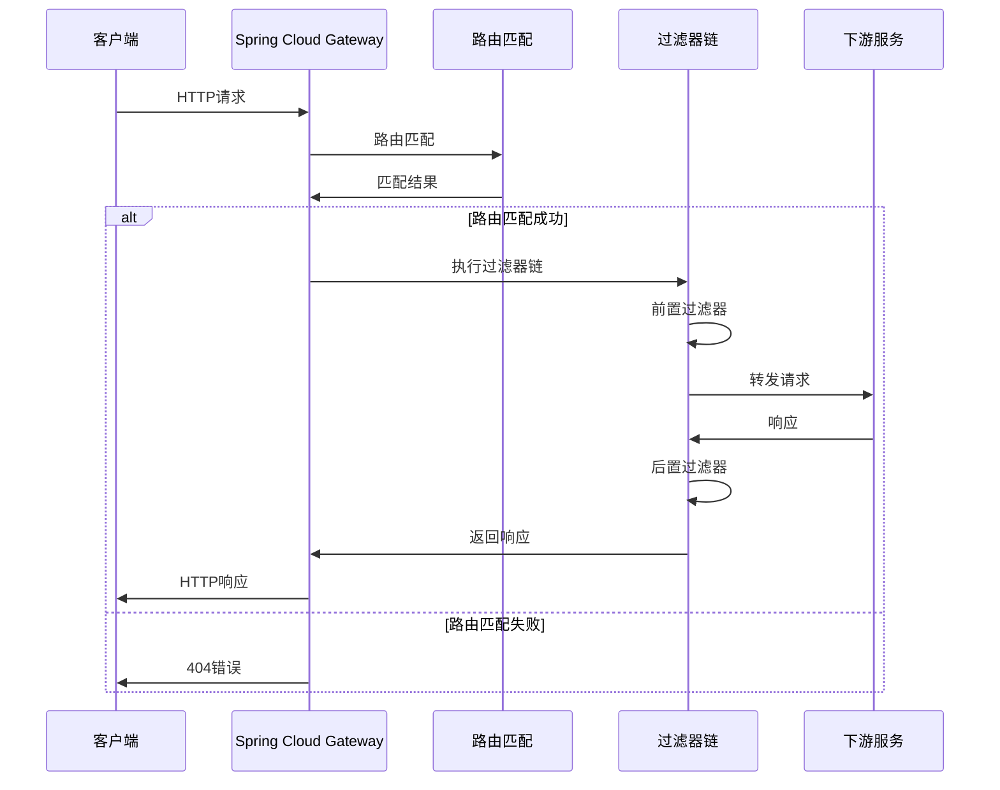
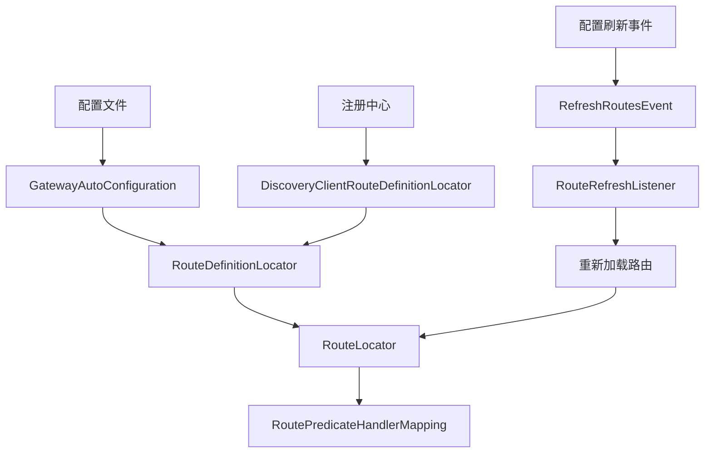
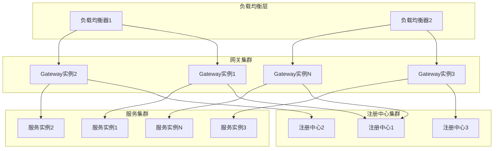
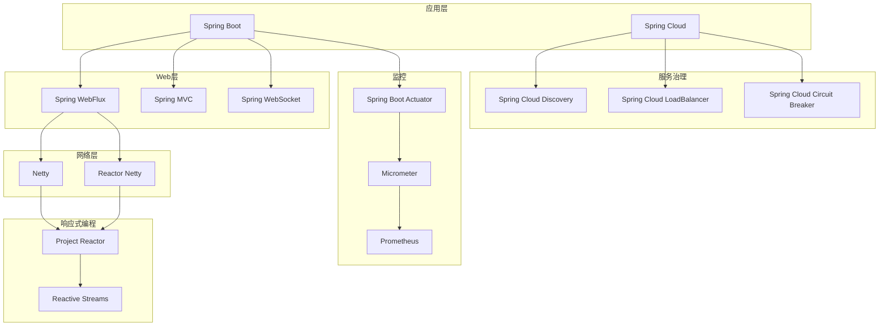
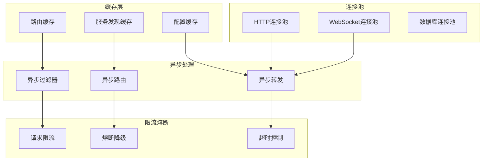

# Spring Cloud Gateway 架构图详解

## 一、系统整体架构图

### 1. 分层架构图


### 2. 核心组件架构图
```
┌─────────────────────────────────────────────────────────────────────────────────┐
│                              Spring Cloud Gateway                               │
├─────────────────────────────────────────────────────────────────────────────────┤
│  ┌─────────────────┐  ┌─────────────────┐  ┌─────────────────┐  ┌─────────────┐ │
│  │   WebFlux       │  │     MVC         │  │   WebSocket     │  │   Actuator  │ │
│  │   (响应式)      │  │   (Servlet)     │  │   (实时)        │  │   (监控)    │ │
│  └─────────────────┘  └─────────────────┘  └─────────────────┘  └─────────────┘ │
├─────────────────────────────────────────────────────────────────────────────────┤
│  ┌─────────────────┐  ┌─────────────────┐  ┌─────────────────┐  ┌─────────────┐ │
│  │ RoutePredicate  │  │ RouteLocator    │  │ RouteDefinition │  │ Discovery   │ │
│  │ HandlerMapping  │  │ (路由定位器)     │  │ (路由定义)       │  │ Client      │ │
│  └─────────────────┘  └─────────────────┘  └─────────────────┘  └─────────────┘ │
├─────────────────────────────────────────────────────────────────────────────────┤
│  ┌─────────────────┐  ┌─────────────────┐  ┌─────────────────┐  ┌─────────────┐ │
│  │ FilteringWeb    │  │ GatewayFilter   │  │ GlobalFilter    │  │ FilterChain │ │
│  │ Handler         │  │ (网关过滤器)     │  │ (全局过滤器)     │  │ (过滤器链)   │ │
│  └─────────────────┘  └─────────────────┘  └─────────────────┘  └─────────────┘ │
├─────────────────────────────────────────────────────────────────────────────────┤
│  ┌─────────────────┐  ┌─────────────────┐  ┌─────────────────┐  ┌─────────────┐ │
│  │ NettyRouting    │  │ LoadBalancer    │  │ HTTP客户端      │  │ WebSocket   │ │
│  │ Filter          │  │ (负载均衡)       │  │ (请求转发)      │  │ 客户端      │ │
│  └─────────────────┘  └─────────────────┘  └─────────────────┘  └─────────────┘ │
└─────────────────────────────────────────────────────────────────────────────────┘
```

## 二、组件交互架构图

### 1. 请求处理流程图


### 2. 过滤器链执行图

```mermaid
graph LR
    A[请求进入] --> B[GlobalFilter1]
    B --> C[GlobalFilter2]
    C --> D[GatewayFilter1]
    D --> E[GatewayFilter2]
    E --> F[NettyRoutingFilter]
    F --> G[下游服务]
    G --> H[ResponseFilter1]
    H --> I[ResponseFilter2]
    I --> J[GlobalFilter2]
    J --> K[GlobalFilter1]
    K --> L[响应返回]
    
    style A fill:#e1f5fe
    style L fill:#e8f5e8
    style F fill:#fff3e0
    style G fill:#f3e5f5
```


## 三、数据流架构图

### 1. 请求数据流图
```
┌─────────────────────────────────────────────────────────────────────────────────┐
│                                请求数据流                                        │
├─────────────────────────────────────────────────────────────────────────────────┤
│                                                                                 │
│  客户端请求                                                                      │
│  ┌─────────────────────────────────────────────────────────────────────────────┐ │
│  │ HTTP Request: GET /api/users                                                │ │
│  │ Headers: Content-Type: application/json                                    │ │
│  │ Body: {"id": 123}                                                          │ │
│  └─────────────────────────────────────────────────────────────────────────────┘ │
│                                    ↓                                           │
│  ┌─────────────────────────────────────────────────────────────────────────────┐ │
│  │ RoutePredicateHandlerMapping                                                │ │
│  │ - 解析请求路径                                                              │ │
│  │ - 匹配路由规则                                                              │ │
│  │ - 确定目标服务                                                              │ │
│  └─────────────────────────────────────────────────────────────────────────────┘ │
│                                    ↓                                           │
│  ┌─────────────────────────────────────────────────────────────────────────────┐ │
│  │ FilteringWebHandler                                                         │ │
│  │ - 构建过滤器链                                                              │ │
│  │ - 执行前置过滤器                                                            │ │
│  │ - 转发请求                                                                  │ │
│  │ - 执行后置过滤器                                                            │ │
│  └─────────────────────────────────────────────────────────────────────────────┘ │
│                                    ↓                                           │
│  ┌─────────────────────────────────────────────────────────────────────────────┐ │
│  │ NettyRoutingFilter                                                          │ │
│  │ - 创建HTTP客户端                                                            │ │
│  │ - 转发到下游服务                                                            │ │
│  │ - 处理响应                                                                  │ │
│  └─────────────────────────────────────────────────────────────────────────────┘ │
│                                    ↓                                           │
│  ┌─────────────────────────────────────────────────────────────────────────────┐ │
│  │ 下游服务响应                                                                │ │
│  │ HTTP Response: 200 OK                                                       │ │
│  │ Headers: Content-Type: application/json                                    │ │
│  │ Body: {"id": 123, "name": "John"}                                          │ │
│  └─────────────────────────────────────────────────────────────────────────────┘ │
└─────────────────────────────────────────────────────────────────────────────────┘
```

### 2. 配置数据流图


## 四、部署架构图

### 1. 单机部署架构
```
┌─────────────────────────────────────────────────────────────────────────────────┐
│                             单机部署架构                                         │
├─────────────────────────────────────────────────────────────────────────────────┤
│                                                                                 │
│  ┌─────────────────────────────────────────────────────────────────────────────┐ │
│  │                        Spring Cloud Gateway                                │ │
│  │  ┌─────────────┐  ┌─────────────┐  ┌─────────────┐  ┌─────────────────────┐ │ │
│  │  │  路由配置   │  │  过滤器链   │  │  服务发现   │  │      监控端点        │ │ │
│  │  │  (YAML)     │  │  (Chain)    │  │  (Client)   │  │    (Actuator)       │ │ │
│  │  └─────────────┘  └─────────────┘  └─────────────┘  └─────────────────────┘ │
│  └─────────────────────────────────────────────────────────────────────────────┘ │
│                                    ↓                                           │
│  ┌─────────────────────────────────────────────────────────────────────────────┐ │
│  │                             注册中心                                        │ │
│  │  ┌─────────────┐  ┌─────────────┐  ┌─────────────┐  ┌─────────────────────┐ │ │
│  │  │   Eureka    │  │   Nacos     │  │   Consul    │  │   Zookeeper         │ │ │
│  │  │  (Netflix)  │  │  (Alibaba)  │  │  (HashiCorp)│  │   (Apache)          │ │ │
│  │  └─────────────┘  └─────────────┘  └─────────────┘  └─────────────────────┘ │
│  └─────────────────────────────────────────────────────────────────────────────┘ │
│                                    ↓                                           │
│  ┌─────────────────────────────────────────────────────────────────────────────┐ │
│  │                             下游服务                                        │ │
│  │  ┌─────────────┐  ┌─────────────┐  ┌─────────────┐  ┌─────────────────────┐ │ │
│  │  │ 用户服务    │  │ 订单服务    │  │ 商品服务    │  │      其他服务        │ │ │
│  │  │ (User)      │  │ (Order)     │  │ (Product)   │  │     (Others)         │ │ │
│  │  └─────────────┘  └─────────────┘  └─────────────┘  └─────────────────────┘ │ │
│  └─────────────────────────────────────────────────────────────────────────────┘ │
└─────────────────────────────────────────────────────────────────────────────────┘
```

### 2. 集群部署架构


### 3. 高可用部署架构
```
┌─────────────────────────────────────────────────────────────────────────────────┐
│                             高可用部署架构                                       │
├─────────────────────────────────────────────────────────────────────────────────┤
│                                                                                 │
│  ┌─────────────────┐                    ┌─────────────────┐                    │
│  │   客户端集群    │                    │   客户端集群    │                    │
│  │  (Client Pool)  │                    │  (Client Pool)  │                    │
│  └─────────────────┘                    └─────────────────┘                    │
│           │                                        │                           │
│           ▼                                        ▼                           │
│  ┌─────────────────┐                    ┌─────────────────┐                    │
│  │  负载均衡器     │                    │  负载均衡器     │                    │
│  │  (Load Balancer)│                    │  (Load Balancer)│                    │
│  └─────────────────┘                    └─────────────────┘                    │
│           │                                        │                           │
│           └────────────────┬───────────────────────┘                           │
│                            ▼                                                 │
│  ┌─────────────────────────────────────────────────────────────────────────────┐ │
│  │                           网关集群                                          │ │
│  │  ┌─────────────┐  ┌─────────────┐  ┌─────────────┐  ┌─────────────────────┐ │ │
│  │  │ Gateway 1   │  │ Gateway 2   │  │ Gateway 3   │  │     Gateway N       │ │ │
│  │  │ (Active)    │  │ (Active)    │  │ (Standby)   │  │     (Standby)       │ │ │
│  │  └─────────────┘  └─────────────┘  └─────────────┘  └─────────────────────┘ │ │
│  └─────────────────────────────────────────────────────────────────────────────┘ │
│                            │                                                 │
│                            ▼                                                 │
│  ┌─────────────────────────────────────────────────────────────────────────────┐ │
│  │                          注册中心集群                                       │ │
│  │  ┌─────────────┐  ┌─────────────┐  ┌─────────────┐  ┌─────────────────────┐ │ │
│  │  │ Eureka 1    │  │ Eureka 2    │  │ Eureka 3    │  │     Config          │ │ │
│  │  │ (Primary)   │  │ (Secondary) │  │ (Tertiary)  │  │   (Backup)          │ │ │
│  │  └─────────────┘  └─────────────┘  └─────────────┘  └─────────────────────┘ │ │
│  └─────────────────────────────────────────────────────────────────────────────┘ │
│                            │                                                 │
│                            ▼                                                 │
│  ┌─────────────────────────────────────────────────────────────────────────────┐ │
│  │                          服务集群                                          │ │
│  │  ┌─────────────┐  ┌─────────────┐  ┌─────────────┐  ┌─────────────────────┐ │ │
│  │  │ 服务A实例1  │  │ 服务A实例2  │  │ 服务B实例1  │  │     服务B实例2       │ │ │
│  │  │ (Active)    │  │ (Standby)   │  │ (Active)    │  │     (Standby)        │ │ │
│  │  └─────────────┘  └─────────────┘  └─────────────┘  └─────────────────────┘ │ │
│  └─────────────────────────────────────────────────────────────────────────────┘ │
└─────────────────────────────────────────────────────────────────────────────────┘
```

## 五、技术栈架构图

### 1. 核心技术栈


### 2. 扩展技术栈
```
┌─────────────────────────────────────────────────────────────────────────────────┐
│                             扩展技术栈                                          │
├─────────────────────────────────────────────────────────────────────────────────┤
│                                                                                 │
│  ┌─────────────────┐  ┌─────────────────┐  ┌─────────────────┐  ┌─────────────┐ │
│  │   服务发现      │  │   配置中心      │  │   监控告警      │  │   安全认证   │ │
│  │                 │  │                 │  │                 │  │             │ │
│  │ • Eureka        │  │ • Nacos         │  │ • Prometheus    │  │ • OAuth2    │ │
│  │ • Nacos         │  │ • Apollo        │  │ • Grafana       │  │ • JWT       │ │
│  │ • Consul        │  │ • Spring Config │  │ • AlertManager  │  │ • Spring    │ │
│  │ • Zookeeper     │  │ • etcd          │  │ • ELK Stack     │  │   Security  │ │
│  └─────────────────┘  └─────────────────┘  └─────────────────┘  └─────────────┘ │
│                                                                                 │
│  ┌─────────────────┐  ┌─────────────────┐  ┌─────────────────┐  ┌─────────────┐ │
│  │   负载均衡      │  │   熔断降级      │  │   链路追踪      │  │   日志管理   │ │
│  │                 │  │                 │  │                 │  │             │ │
│  │ • Spring Cloud  │  │ • Resilience4j  │  │ • Sleuth        │  │ • Logback   │ │
│  │   LoadBalancer  │  │ • Hystrix       │  │ • Zipkin        │  │ • Log4j2    │ │
│  │ • Ribbon        │  │ • Sentinel      │  │ • Jaeger        │  │ • ELK       │ │
│  │ • Nginx         │  │ • Circuit       │  │ • SkyWalking   │  │ • Fluentd   │ │
│  │   (LVS)         │  │ • Circuit       │  │ • SkyWalking   │  │ • Fluentd   │ │
│  │   Breaker       │  │   Breaker       │  │                 │  │             │ │
│  │                 │  │                 │  │                 │  │             │ │
│  │ • SkyWalking   │  │ • SkyWalking   │  │                 │  │             │ │
│  │ • ELK Stack     │  │ • ELK Stack     │  │                 │  │             │ │
│  │ • Fluentd       │  │ • Fluentd       │  │                 │  │             │ │
│  └─────────────────┘  └─────────────────┘  └─────────────────┘  └─────────────┘ │
└─────────────────────────────────────────────────────────────────────────────────┘
```

## 六、性能架构图

### 1. 性能优化架构


### 2. 监控架构图
```
┌─────────────────────────────────────────────────────────────────────────────────┐
│                             监控架构图                                          │
├─────────────────────────────────────────────────────────────────────────────────┤
│                                                                                 │
│  ┌─────────────────┐  ┌─────────────────┐  ┌─────────────────┐  ┌─────────────┐ │
│  │   应用监控      │  │   系统监控      │  │   业务监控      │  │   告警通知   │ │
│  │                 │  │                 │  │                 │  │             │ │
│  │ • JVM指标       │  │ • CPU使用率     │  │ • 请求量        │  │ • 邮件告警   │ │
│  │ • 内存使用      │  │ • 内存使用率    │  │ • 响应时间      │  │ • 短信告警   │ │
│  │ • 线程状态      │  │ • 磁盘IO        │  │ • 错误率        │  │ • 钉钉告警   │ │
│  │ • GC情况        │  │ • 网络IO        │  │ • 成功率        │  │ • 微信告警   │ │
│  └─────────────────┘  └─────────────────┘  └─────────────────┘  └─────────────┘ │
│           │                     │                     │                     │   │
│           └─────────────────────┼─────────────────────┼─────────────────────┘   │
│                                 ▼                     ▼                         │
│  ┌─────────────────────────────────────────────────────────────────────────────┐ │
│  │                             监控数据收集                                    │ │
│  │  ┌─────────────┐  ┌─────────────┐  ┌─────────────┐  ┌─────────────────────┐ │ │
│  │  │ Actuator    │  │ Micrometer  │  │ Prometheus  │  │    自定义指标        │ │ │
│  │  │ 端点        │  │ 指标收集    │  │ 数据抓取    │  │    收集器            │ │ │
│  │  └─────────────┘  └─────────────┘  └─────────────┘  └─────────────────────┘ │ │
│  └─────────────────────────────────────────────────────────────────────────────┘ │
│                                 ▼                                               │
│  ┌─────────────────────────────────────────────────────────────────────────────┐ │
│  │                             监控数据存储                                    │ │
│  │  ┌─────────────┐  ┌─────────────┐  ┌─────────────┐  ┌─────────────────────┐ │ │
│  │  │ Prometheus  │  │ InfluxDB    │  │ Elasticsearch│  │    时序数据库        │ │ │
│  │  │ 时序数据库  │  │ 时序数据库  │  │ 日志存储    │  │    存储              │ │ │
│  │  └─────────────┘  └─────────────┘  └─────────────┘  └─────────────────────┘ │ │
│  └─────────────────────────────────────────────────────────────────────────────┘ │
│                                 ▼                                               │
│  ┌─────────────────────────────────────────────────────────────────────────────┐ │
│  │                             监控数据展示                                    │ │
│  │  ┌─────────────┐  ┌─────────────┐  ┌─────────────┐  ┌─────────────────────┐ │ │
│  │  │ Grafana     │  │ Kibana      │  │ 自定义      │  │    监控大屏          │ │ │
│  │  │ 仪表板      │  │ 日志分析    │  │ 监控面板    │  │    展示              │ │ │
│  │  └─────────────┘  └─────────────┘  └─────────────┘  └─────────────────────┘ │ │
│  └─────────────────────────────────────────────────────────────────────────────┘ │
└─────────────────────────────────────────────────────────────────────────────────┘
```

---

这份架构图详解文档包含了 Spring Cloud Gateway 的完整架构视图，从系统整体架构到具体的部署方案，从技术栈到性能优化，全面展示了网关系统的设计思路和实现方案。每个图表都配有详细的说明，帮助理解各个组件之间的关系和作用。 