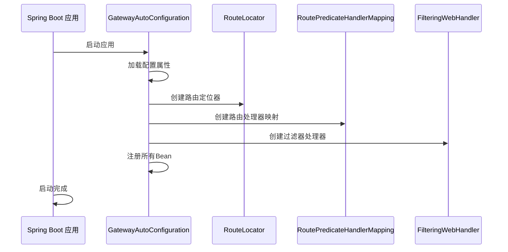
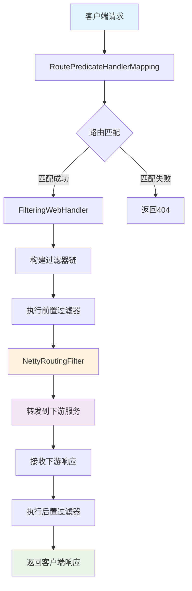
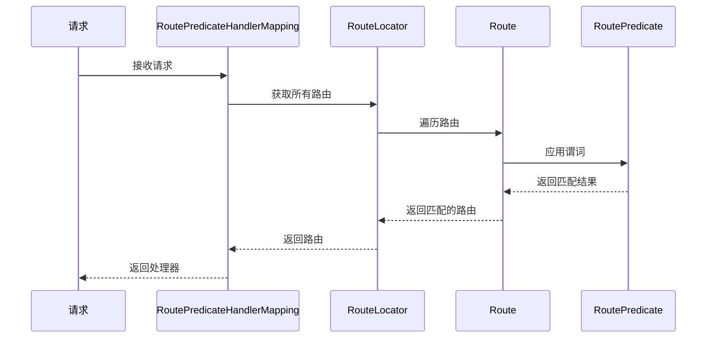
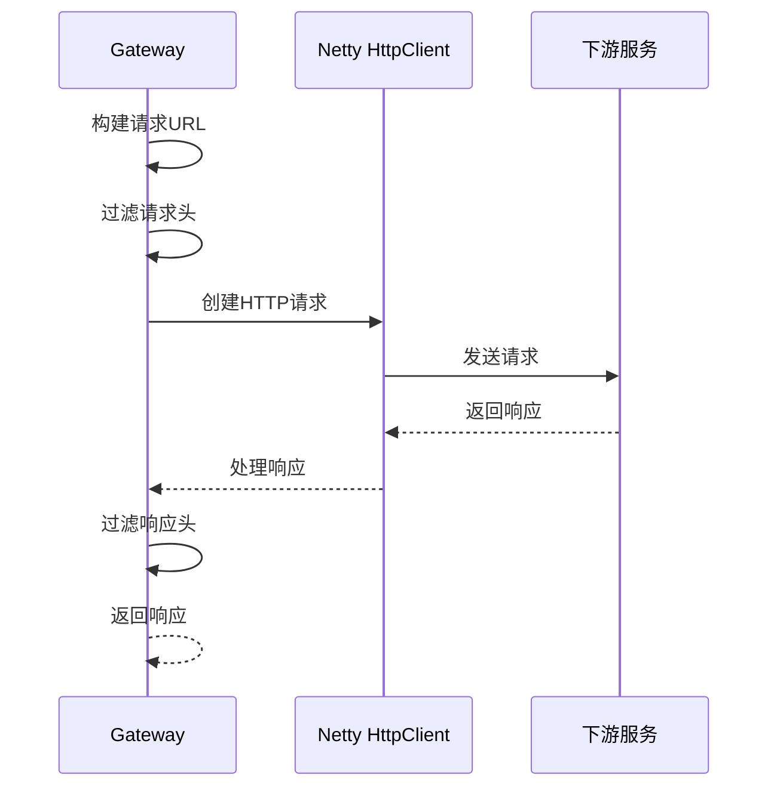

# Spring Cloud Gateway 核心流程与入口文件分析

## 一、应用启动流程

### 1. 启动入口分析

Spring Cloud Gateway 的启动入口主要通过以下方式：

#### 1.1 自动配置入口
```java
@Configuration(proxyBeanMethods = false)
@ConditionalOnProperty(name = "spring.cloud.gateway.enabled", matchIfMissing = true)
@EnableConfigurationProperties
@AutoConfigureBefore({ HttpHandlerAutoConfiguration.class, WebFluxAutoConfiguration.class })
@AutoConfigureAfter({ GatewayReactiveLoadBalancerClientAutoConfiguration.class,
        GatewayClassPathWarningAutoConfiguration.class })
@ConditionalOnClass(DispatcherHandler.class)
public class GatewayAutoConfiguration {
    // 核心自动配置类
}
```

#### 1.2 启动流程时序图


### 2. 核心Bean装配流程

#### 2.1 路由相关Bean
```java
// 1. 路由定义定位器
@Bean
@ConditionalOnMissingBean
public PropertiesRouteDefinitionLocator propertiesRouteDefinitionLocator(GatewayProperties properties) {
    return new PropertiesRouteDefinitionLocator(properties);
}

// 2. 路由定位器
@Bean
public RouteLocator routeDefinitionRouteLocator(GatewayProperties properties,
        List<GatewayFilterFactory> gatewayFilters, List<RoutePredicateFactory> predicates,
        RouteDefinitionLocator routeDefinitionLocator, ConfigurationService configurationService) {
    return new RouteDefinitionRouteLocator(properties, gatewayFilters, predicates, 
            routeDefinitionLocator, configurationService);
}

// 3. 路由处理器映射
@Bean
@ConditionalOnMissingBean
public RoutePredicateHandlerMapping routePredicateHandlerMapping(FilteringWebHandler webHandler,
        RouteLocator routeLocator, GlobalCorsProperties globalCorsProperties, Environment environment) {
    return new RoutePredicateHandlerMapping(webHandler, routeLocator, globalCorsProperties, environment);
}
```

#### 2.2 过滤器相关Bean
```java
// 1. 过滤器处理器
@Bean
@ConditionalOnMissingBean
public FilteringWebHandler filteringWebHandler(List<GlobalFilter> globalFilters, GatewayProperties properties) {
    return new FilteringWebHandler(globalFilters, properties.isRouteFilterCacheEnabled());
}

// 2. 全局过滤器
@Bean
@ConditionalOnEnabledGlobalFilter
public NettyRoutingFilter routingFilter(HttpClient httpClient,
        ObjectProvider<List<HttpHeadersFilter>> headersFilters, HttpClientProperties properties) {
    return new NettyRoutingFilter(httpClient, headersFilters, properties);
}
```

## 二、请求处理核心流程

### 1. 请求处理流程图



### 2. 核心组件分析

#### 2.1 RoutePredicateHandlerMapping - 路由匹配入口

**核心职责**：
- 接收所有HTTP请求
- 根据路由谓词进行路由匹配
- 将匹配的路由信息存储到Exchange中

**关键方法**：
```java
@Override
protected Mono<?> getHandlerInternal(ServerWebExchange exchange) {
    // 检查管理端口
    if (this.managementPortType == DIFFERENT && this.managementPort != null
            && exchange.getRequest().getLocalAddress() != null
            && exchange.getRequest().getLocalAddress().getPort() == this.managementPort) {
        return Mono.empty();
    }
    
    return lookupRoute(exchange)
        .map(route -> {
            exchange.getAttributes().put(GATEWAY_ROUTE_ATTR, route);
            return webHandler;
        })
        .switchIfEmpty(Mono.empty());
}

protected Mono<Route> lookupRoute(ServerWebExchange exchange) {
    return this.routeLocator.getRoutes()
        .filterWhen(route -> {
            exchange.getAttributes().put(GATEWAY_PREDICATE_ROUTE_ATTR, route.getId());
            return route.getPredicate().apply(exchange);
        })
        .next()
        .map(route -> {
            validateRoute(route, exchange);
            return route;
        });
}
```

#### 2.2 FilteringWebHandler - 过滤器链处理器

**核心职责**：
- 构建全局过滤器和路由过滤器的组合链
- 按顺序执行过滤器链
- 管理过滤器缓存

**关键方法**：
```java
@Override
public Mono<Void> handle(ServerWebExchange exchange) {
    Route route = exchange.getRequiredAttribute(GATEWAY_ROUTE_ATTR);
    List<GatewayFilter> combined = getCombinedFilters(route);
    
    return new DefaultGatewayFilterChain(combined).filter(exchange);
}

protected List<GatewayFilter> getCombinedFilters(Route route) {
    if (this.routeFilterCacheEnabled) {
        return routeFilterMap.computeIfAbsent(route, this::getAllFilters);
    }
    else {
        return getAllFilters(route);
    }
}

protected List<GatewayFilter> getAllFilters(Route route) {
    List<GatewayFilter> gatewayFilters = route.getFilters();
    List<GatewayFilter> combined = new ArrayList<>(this.globalFilters);
    combined.addAll(gatewayFilters);
    AnnotationAwareOrderComparator.sort(combined);
    return combined;
}
```

#### 2.3 NettyRoutingFilter - 请求转发核心

**核心职责**：
- 使用Netty HttpClient转发请求到下游服务
- 处理请求和响应的HTTP头
- 管理连接超时和响应超时

**关键方法**：
```java
@Override
public Mono<Void> filter(ServerWebExchange exchange, GatewayFilterChain chain) {
    URI requestUrl = exchange.getRequiredAttribute(GATEWAY_REQUEST_URL_ATTR);
    
    // 检查是否已经路由
    if (isAlreadyRouted(exchange) || (!"http".equalsIgnoreCase(scheme) && !"https".equalsIgnoreCase(scheme))) {
        return chain.filter(exchange);
    }
    setAlreadyRouted(exchange);
    
    // 构建HTTP请求
    ServerHttpRequest request = exchange.getRequest();
    final HttpMethod method = HttpMethod.valueOf(request.getMethod().name());
    final String url = requestUrl.toASCIIString();
    
    // 过滤请求头
    HttpHeaders filtered = filterRequest(getHeadersFilters(), exchange);
    
    // 发送请求到下游服务
    Flux<HttpClientResponse> responseFlux = getHttpClientMono(route, exchange)
        .flatMapMany(httpClient -> httpClient.headers(headers -> {
            headers.add(httpHeaders);
            headers.remove(HttpHeaders.HOST);
            if (preserveHost) {
                String host = request.getHeaders().getFirst(HttpHeaders.HOST);
                headers.add(HttpHeaders.HOST, host);
            }
        }).request(method).uri(url).send((req, nettyOutbound) -> {
            return nettyOutbound.send(request.getBody().map(this::getByteBuf));
        }).responseConnection((res, connection) -> {
            // 处理响应
            exchange.getAttributes().put(CLIENT_RESPONSE_ATTR, res);
            exchange.getAttributes().put(CLIENT_RESPONSE_CONN_ATTR, connection);
            
            // 设置响应状态和头
            setResponseStatus(res, response);
            HttpHeaders filteredResponseHeaders = HttpHeadersFilter.filter(getHeadersFilters(), headers, exchange, Type.RESPONSE);
            response.getHeaders().addAll(filteredResponseHeaders);
            
            return Mono.just(res);
        }));
    
    return responseFlux.then(chain.filter(exchange));
}
```

## 三、核心流程详解

### 1. 路由匹配流程

#### 1.1 路由匹配步骤


#### 1.2 路由谓词类型
| 谓词类型 | 功能描述 | 配置示例 |
|---------|---------|---------|
| **Path** | 路径匹配 | `Path=/api/**` |
| **Host** | 主机匹配 | `Host=**.example.com` |
| **Method** | HTTP方法匹配 | `Method=GET,POST` |
| **Header** | 请求头匹配 | `Header=X-Request-Id, \d+` |
| **Query** | 查询参数匹配 | `Query=name, \w+` |
| **Cookie** | Cookie匹配 | `Cookie=sessionId, \w+` |
| **After** | 时间匹配 | `After=2023-01-01T00:00:00+08:00` |
| **Before** | 时间匹配 | `Before=2023-12-31T23:59:59+08:00` |
| **Between** | 时间范围匹配 | `Between=2023-01-01T00:00:00+08:00, 2023-12-31T23:59:59+08:00` |
| **RemoteAddr** | 远程地址匹配 | `RemoteAddr=192.168.1.1/24` |

### 2. 过滤器链执行流程

#### 2.1 过滤器执行顺序

```mermaid
graph LR
    A[请求进入] --> B[GlobalFilter1]
    B --> C[GlobalFilter2]
    C --> D[GatewayFilter1]
    D --> E[GatewayFilter2]
    E --> F[NettyRoutingFilter]
    F --> G[下游服务]
    G --> H[ResponseFilter1]
    H --> I[ResponseFilter2]
    I --> J[GlobalFilter2]
    J --> K[GlobalFilter1]
    K --> L[响应返回]
    
    style A fill:#e1f5fe
    style L fill:#e8f5e8
    style F fill:#fff3e0
    style G fill:#f3e5f5
```


#### 2.2 过滤器链实现
```java
private static class DefaultGatewayFilterChain implements GatewayFilterChain {
    private final int index;
    private final List<GatewayFilter> filters;
    
    @Override
    public Mono<Void> filter(ServerWebExchange exchange) {
        return Mono.defer(() -> {
            if (this.index < filters.size()) {
                GatewayFilter filter = filters.get(this.index);
                DefaultGatewayFilterChain chain = new DefaultGatewayFilterChain(this, this.index + 1);
                return filter.filter(exchange, chain);
            }
            else {
                return Mono.empty(); // 完成
            }
        });
    }
}
```

### 3. 请求转发流程

#### 3.1 HTTP请求转发


#### 3.2 负载均衡集成
```java
protected Mono<HttpClient> getHttpClientMono(Route route, ServerWebExchange exchange) {
    // 获取负载均衡客户端
    ReactiveLoadBalancer<ServiceInstance> loadBalancer = getLoadBalancer(route);
    if (loadBalancer != null) {
        return loadBalancer.choose(route.getId())
            .map(serviceInstance -> getHttpClient(serviceInstance, route, exchange));
    }
    return Mono.just(getHttpClient(route, exchange));
}
```

## 四、关键入口文件分析

### 1. 自动配置入口 - GatewayAutoConfiguration

**文件位置**: `spring-cloud-gateway-server/src/main/java/org/springframework/cloud/gateway/config/GatewayAutoConfiguration.java`

**核心功能**：
- 自动装配所有网关相关的Bean
- 配置路由定位器、过滤器、谓词等组件
- 集成服务发现、负载均衡等功能

**关键Bean定义**：
```java
// 路由相关
@Bean public RouteLocator routeDefinitionRouteLocator(...)
@Bean public RoutePredicateHandlerMapping routePredicateHandlerMapping(...)
@Bean public FilteringWebHandler filteringWebHandler(...)

// 过滤器相关
@Bean public NettyRoutingFilter routingFilter(...)
@Bean public NettyWriteResponseFilter nettyWriteResponseFilter(...)
@Bean public WebsocketRoutingFilter websocketRoutingFilter(...)

// 谓词相关
@Bean public PathRoutePredicateFactory pathRoutePredicateFactory()
@Bean public HostRoutePredicateFactory hostRoutePredicateFactory()
@Bean public MethodRoutePredicateFactory methodRoutePredicateFactory()
```

### 2. 路由处理器映射 - RoutePredicateHandlerMapping

**文件位置**: `spring-cloud-gateway-server/src/main/java/org/springframework/cloud/gateway/handler/RoutePredicateHandlerMapping.java`

**核心功能**：
- 继承AbstractHandlerMapping，作为WebFlux的处理器映射
- 负责路由匹配和处理器选择
- 管理管理端口的处理逻辑

**关键特性**：
- 支持管理端口分离
- 路由谓词匹配
- CORS配置支持

### 3. 过滤器处理器 - FilteringWebHandler

**文件位置**: `spring-cloud-gateway-server/src/main/java/org/springframework/cloud/gateway/handler/FilteringWebHandler.java`

**核心功能**：
- 实现WebHandler接口，处理Web请求
- 管理全局过滤器和路由过滤器的组合
- 支持过滤器缓存优化

**关键特性**：
- 过滤器链构建
- 过滤器排序
- 缓存机制

### 4. 网络路由过滤器 - NettyRoutingFilter

**文件位置**: `spring-cloud-gateway-server/src/main/java/org/springframework/cloud/gateway/filter/NettyRoutingFilter.java`

**核心功能**：
- 使用Netty HttpClient转发HTTP请求
- 处理请求和响应的HTTP头
- 管理连接和响应超时

**关键特性**：
- 异步非阻塞请求转发
- 请求头过滤
- 超时控制
- 负载均衡集成

## 五、性能优化机制

### 1. 过滤器缓存
```java
// 启用路由过滤器缓存
spring:
  cloud:
    gateway:
      route-filter-cache-enabled: true
```

### 2. 连接池配置
```java
// HTTP客户端连接池配置
spring:
  cloud:
    gateway:
      httpclient:
        pool:
          max-connections: 200
          acquire-timeout: 45s
          max-idle-time: 15s
```

### 3. 响应式编程优势
- 非阻塞I/O处理
- 背压控制
- 资源高效利用

## 六、扩展点分析

### 1. 自定义过滤器
```java
@Component
public class CustomGlobalFilter implements GlobalFilter, Ordered {
    @Override
    public Mono<Void> filter(ServerWebExchange exchange, GatewayFilterChain chain) {
        // 自定义逻辑
        return chain.filter(exchange);
    }
    
    @Override
    public int getOrder() {
        return -1; // 高优先级
    }
}
```

### 2. 自定义谓词
```java
@Component
public class CustomRoutePredicateFactory extends AbstractRoutePredicateFactory<CustomRoutePredicateFactory.Config> {
    public CustomRoutePredicateFactory() {
        super(Config.class);
    }
    
    @Override
    public Predicate<ServerWebExchange> apply(Config config) {
        return exchange -> {
            // 自定义匹配逻辑
            return true;
        };
    }
}
```

---

这份文档详细分析了 Spring Cloud Gateway 的核心流程和入口文件，从应用启动到请求处理的完整流程，帮助理解网关的工作原理和实现机制。 