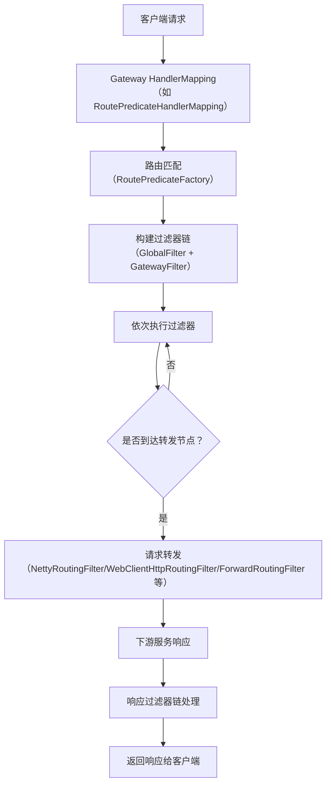

# Spring Cloud Gateway 核心功能与请求处理流程图

---

## 一、核心功能流程步骤

1. **接收请求**
   - 客户端发起 HTTP/HTTPS 请求到 Gateway。
   - 请求首先被 Gateway 的入口（如 WebFlux 的 HandlerMapping）捕获。

2. **路由匹配**
   - Gateway 根据配置的路由规则（RoutePredicateFactory，如 Path、Host、Method 等）对请求进行匹配，确定目标 Route。
   - 匹配成功后，将 Route 信息存入 `ServerWebExchange` 的属性中。

3. **过滤器链处理**
   - 构建全局过滤器（GlobalFilter）和路由过滤器（GatewayFilter）的有序链。
   - 依次执行过滤器链，每个过滤器可对请求进行处理（如鉴权、限流、日志、修改请求等）。
   - 过滤器链的最后阶段会进行请求的实际转发。

4. **请求转发**
   - 根据 Route 的目标 URI，选择合适的转发方式（如 HTTP、WebSocket、Forward、本地负载均衡等）。
   - 典型的 HTTP 请求会通过 Netty/WebClient 进行转发，WebSocket 则通过 WebSocketClient 处理。

5. **响应处理**
   - 下游服务返回响应后，过滤器链可对响应进行处理（如修改响应头、熔断、降级等）。
   - 最终将响应返回给客户端。

---

## 二、详细流程图（WebFlux 典型流程）

---

## 三、关键类与流程说明

- **FilteringWebHandler**  
  负责将请求交给过滤器链处理，最终转发到目标服务。
- **RoutePredicateFactory**  
  路由谓词工厂，决定请求是否匹配某个路由。
- **GatewayFilter/GlobalFilter**  
  过滤器接口，支持对请求和响应的前置、后置处理。
- **NettyRoutingFilter/WebClientHttpRoutingFilter/ForwardRoutingFilter**  
  负责实际的请求转发。
- **ServerWebExchange**  
  请求上下文，贯穿整个处理流程，存储路由、请求、响应等信息。

---

## 四、流程步骤讲解

1. **客户端请求**：用户通过浏览器或其他客户端发起 HTTP 请求到 Gateway。
2. **路由匹配**：Gateway 根据配置的路由规则（如路径、主机、方法等）判断请求应由哪个 Route 处理。
3. **过滤器链处理**：全局过滤器和路由过滤器按顺序处理请求，可实现鉴权、限流、日志、Header/Body 修改等功能。
4. **请求转发**：过滤器链最后阶段将请求转发到下游服务（如微服务、第三方 API）。
5. **响应处理**：下游服务响应后，过滤器链可对响应进行处理（如熔断、降级、Header/Body 修改等）。
6. **返回客户端**：最终响应返回给客户端。

---

如需 MVC 版本（Servlet 环境）或某一环节的详细类图/代码解读，请告知！ 