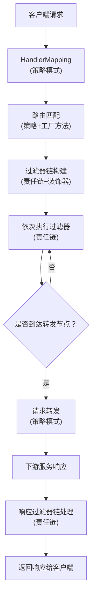
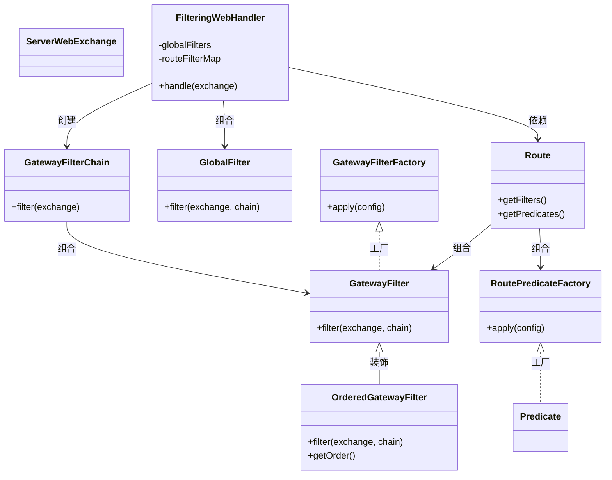

# Spring Cloud Gateway 设计模式与核心流程类图

---

## 一、主要设计模式梳理

| 设计模式         | 作用与应用场景                                                                 |
|------------------|------------------------------------------------------------------------------|
| 责任链模式       | 过滤器链（GlobalFilter、GatewayFilter），请求和响应依次经过多个处理节点         |
| 策略模式         | 路由谓词（RoutePredicateFactory）、过滤器工厂（GatewayFilterFactory）           |
| 工厂方法模式     | 路由谓词工厂、过滤器工厂的创建与扩展                                           |
| 装饰器模式       | OrderedGatewayFilter、GatewayFilterAdapter 对过滤器功能增强                     |
| 观察者模式       | 路由刷新事件（RefreshRoutesEvent）、Spring 事件机制                             |
| 适配器模式       | GatewayFilterAdapter 适配 GlobalFilter 到 GatewayFilter                        |
| 组合模式         | 路由（Route）聚合谓词、过滤器等多个组件                                         |

---

## 二、设计模式下的请求处理流程图

---

## 三、核心类图（简化版）

---

## 四、设计模式与流程步骤讲解

1. **策略模式**  
   路由匹配、过滤器选择等均通过策略模式实现，便于扩展和切换不同的匹配/处理逻辑。
2. **工厂方法模式**  
   路由谓词工厂、过滤器工厂通过工厂方法创建具体实例，支持自定义扩展。
3. **责任链模式**  
   过滤器链（GlobalFilter、GatewayFilter）串联多个处理节点，灵活插拔、组合。
4. **装饰器模式**  
   OrderedGatewayFilter、GatewayFilterAdapter 对过滤器功能增强（如排序、适配）。
5. **观察者模式**  
   路由刷新、事件通知等通过 Spring 事件机制实现。
6. **适配器模式**  
   GlobalFilter 适配为 GatewayFilter，统一处理接口。
7. **组合模式**  
   Route 聚合多个谓词和过滤器，形成完整的路由规则。

---

## 五、总结

Spring Cloud Gateway 通过上述设计模式实现了高内聚、低耦合、易扩展的网关架构。

如需更详细的类图（如各工厂、过滤器的继承关系）或某一设计模式的代码示例，请告知！ 